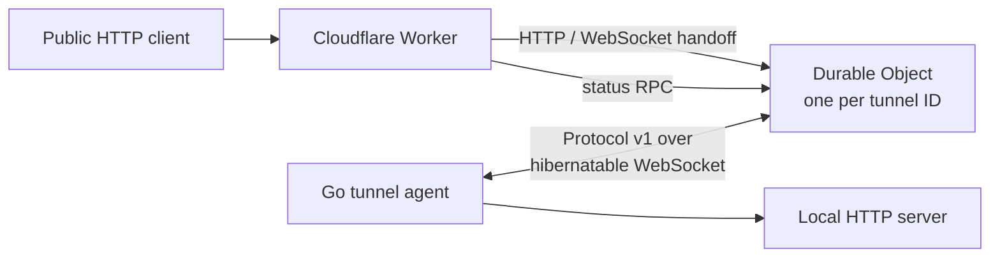
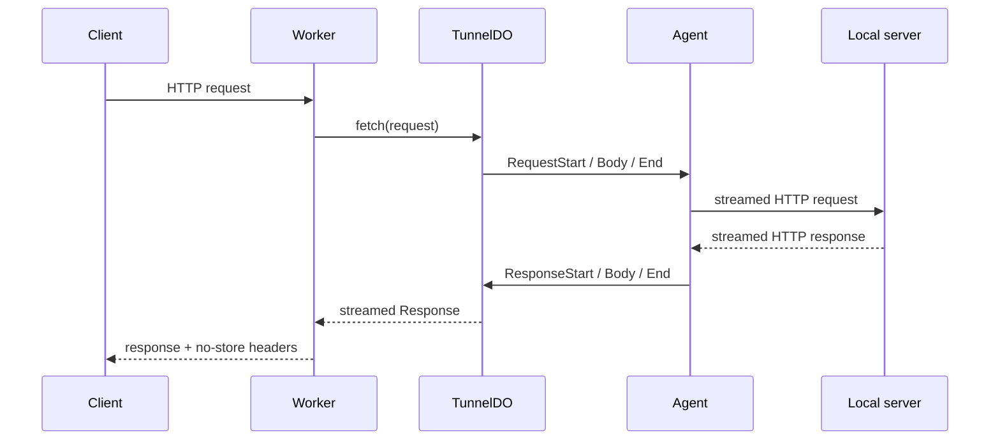

# Architecture

## Components

- The Worker validates API input, derives the tunnel ID from the production
  hostname or development path, and obtains the named Durable Object stub.
- The Durable Object owns the agent WebSocket and in-memory pending-request map.
  It stores connection metadata, never request or response bodies.
- The Go agent exchanges the root secret for a 15-minute agent token, connects,
  and proxies each protocol request to its configured local host and port.
- The protocol package has byte-compatible TypeScript and Go codecs. See
  [protocol.md](./protocol.md).

## Request flow

HTTP proxying and WebSocket upgrade use the Durable Object `fetch()` handler
because they pass `Request`/`Response` objects and streams. Serializable control
operations such as status use Durable Object RPC.

## Connection lifecycle

The agent sends `Hello`; the Durable Object returns server-controlled limits and
the public URL in `HelloAck`. The agent initiates application-level Ping frames.
The Durable Object replies without scheduling timers, allowing WebSocket
hibernation. A new connection for the same tunnel closes the old one with code 4001. Other disconnects trigger token re-minting and exponential reconnect.

## State and bounds

There is no database, global coordinator, queue, KV, R2, Redis, or cache. Durable
Object storage holds only tunnel metadata. Bodies stream in frames no larger than
256 KiB. Default aggregate limits are 50 MiB per request, 100 MiB per response,
32 pending requests, and 30 seconds to response start or between response chunks.
