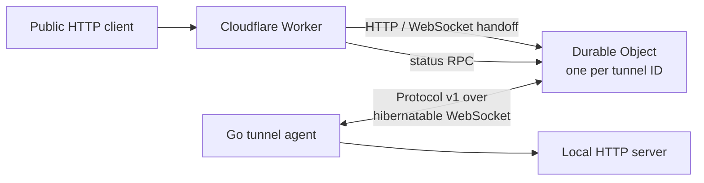
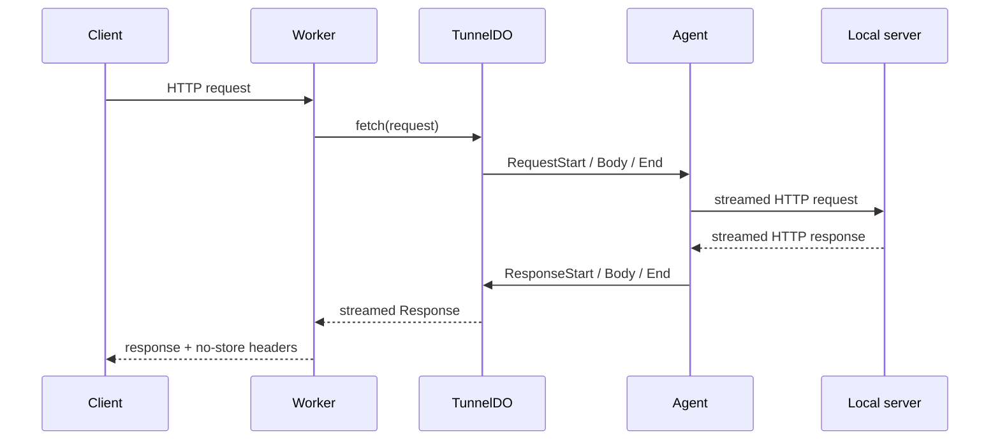

# Architecture

## Components

```mermaid
flowchart LR
    Client[Public HTTP client] --> Worker[Cloudflare Worker]
    Worker -->|HTTP / WebSocket handoff| DO[Durable Object<br/>one per tunnel ID]
    Worker -->|status RPC| DO
    Agent[Go tunnel agent] <-->|Protocol v1 over<br/>hibernatable WebSocket| DO
    Agent --> Local[Local HTTP server]
```

- The API Worker validates API input, derives the tunnel ID from the production
  hostname or development path, and obtains the named Durable Object stub.
- The Durable Object owns the agent WebSocket and in-memory pending-request map.
  It stores connection metadata, never request or response bodies.
- The Go agent exchanges the root secret for a 15-minute agent token, connects,
  and proxies each protocol request to its configured local host and port.
- The protocol package has byte-compatible TypeScript and Go codecs. See
  [protocol.md](./protocol.md).

## Request flow

```mermaid
sequenceDiagram
    participant C as Client
    participant W as Worker
    participant D as TunnelDO
    participant A as Agent
    participant L as Local server
    C->>W: HTTP request
    W->>D: fetch(request)
    D->>A: RequestStart / Body / End
    A->>L: streamed HTTP request
    L-->>A: streamed HTTP response
    A->>D: ResponseStart / Body / End
    D-->>W: streamed Response
    W-->>C: response + no-store headers
```

HTTP proxying and WebSocket upgrade use the Durable Object `fetch()` handler
because they pass `Request`/`Response` objects and streams. Serializable control
operations such as status use Durable Object RPC.

## Connection lifecycle

The agent sends `Hello`; the Durable Object returns server-controlled limits and
the public URL in `HelloAck`. The agent initiates application-level Ping frames.
The Durable Object replies without scheduling timers, allowing WebSocket
hibernation. A new connection for the same tunnel closes the old one with code 4001. Other disconnects trigger token re-minting and exponential reconnect.

## State and bounds

D1 holds custom-domain and preview metadata. R2 is used only for public preview
artifacts; tunnel traffic remains unpersisted. Durable Object storage holds only
tunnel metadata. Bodies stream in frames no larger than 256 KiB. Code defaults
are 50 MiB per request, 100 MiB per response, 32 pending requests, and 30
seconds to response start or between response chunks; production currently
configures 100 pending requests.

## Public applications

- `makarima.xyz` is the SvelteKit landing Worker (`mtunnel-landing`). It serves
  `/`, `/docs`, `/terms`, `/install.sh`, and the site icons and manifest from
  `apps/landing/static`.
- `app.makarima.xyz` is the TanStack Start dashboard Worker (`mtunnel-dashboard`).
- `api.makarima.xyz` and tunnel wildcard hosts are served by `mtunnel-api`.

## Shared Effect core

`packages/core` (`@tunnel/core`) owns schemas, tagged wire errors, WorkOS
authentication, organizations, access limits, custom domains, previews, and
analytics. API and dashboard construct cached Effect runtimes from their own
Cloudflare bindings. Protocol framing remains synchronous and the tunnel
proxy/Durable Object hot path remains imperative.

The dashboard does not call `api.makarima.xyz`. TanStack Start server functions
read D1/R2/Durable Object bindings directly; preview uploads use a streaming
Worker route. The API is CLI-only after dashboard deployment and retains device,
refresh, token, domain, preview, organization, and tunnel endpoints required by
the Go client.
