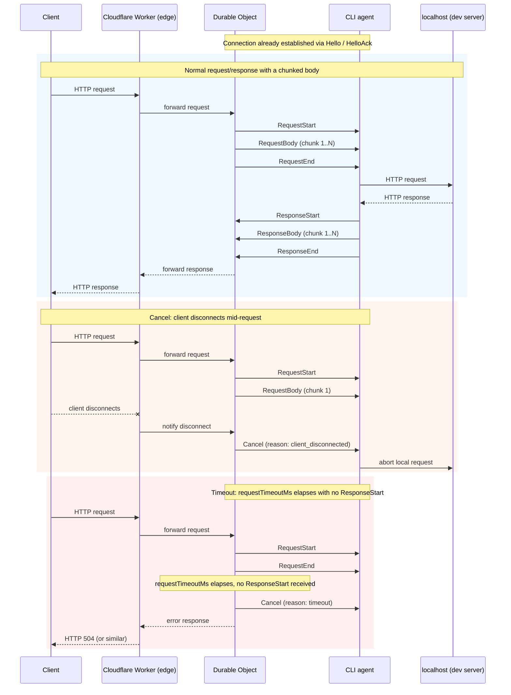

# ztunnel wire protocol v1

## Overview

Protocol v1 is the binary framing format carried over the single WebSocket
connection between the CLI agent (running on the developer's machine) and the
Cloudflare Worker edge (specifically, the Durable Object that owns a tunnel).
It multiplexes two kinds of traffic over that one connection:

- **Control messages** — `Hello`/`HelloAck` to open and configure the tunnel,
  `Ping`/`Pong` for heartbeats, and `Cancel`/`Error` for aborting or reporting
  problems with in-flight requests.
- **Proxied HTTP traffic** — an incoming request to the tunnel's public URL is
  forwarded to the agent as `RequestStart`/`RequestBody`/`RequestEnd` frames;
  the agent proxies it to the developer's local server and streams the
  response back as `ResponseStart`/`ResponseBody`/`ResponseEnd` frames.

Every frame is self-describing (type, request id, length) so many requests
can be interleaved on the same connection without a separate stream-id
negotiation step. The format is implemented identically in TypeScript
(`packages/protocol`) and Go (`agents/tunnel/internal/protocol`); the two
implementations are cross-checked against a shared fixture file
(`packages/protocol/fixtures/frames.json`) to guarantee byte-for-byte
compatibility.

## Frame layout

Each frame is a fixed 22-byte header followed by a variable-length payload,
all big-endian:

| Offset | Field           | Size     | Description                                                |
| ------ | --------------- | -------- | ---------------------------------------------------------- |
| 0      | `version`       | 1 byte   | Protocol version. Must be `0x01`.                          |
| 1      | `type`          | 1 byte   | Frame type (see table below).                              |
| 2–17   | `requestId`     | 16 bytes | Request identifier. All zeros for connection-level frames. |
| 18–21  | `payloadLength` | 4 bytes  | Payload length in bytes, big-endian `uint32`.              |
| 22...  | `payload`       | variable | Exactly `payloadLength` bytes.                             |

- `HEADER_SIZE` = 22 bytes.
- `MAX_FRAME_PAYLOAD_BYTES` = 262,144 bytes (256 KiB) — the maximum payload a
  single frame may carry. Larger request/response bodies are split across
  multiple body frames (see [Size limits and chunking](#size-limits-and-chunking)).

## Frame types

| Value | Name            | Direction        | Payload   |
| ----- | --------------- | ---------------- | --------- |
| 1     | `Hello`         | agent → server   | JSON      |
| 2     | `HelloAck`      | server → agent   | JSON      |
| 3     | `RequestStart`  | server → agent   | JSON      |
| 4     | `RequestBody`   | server → agent   | raw bytes |
| 5     | `RequestEnd`    | server → agent   | empty     |
| 6     | `ResponseStart` | agent → server   | JSON      |
| 7     | `ResponseBody`  | agent → server   | raw bytes |
| 8     | `ResponseEnd`   | agent → server   | empty     |
| 9     | `Cancel`        | either direction | JSON      |
| 10    | `Ping`          | agent → server   | empty     |
| 11    | `Pong`          | server → agent   | empty     |
| 12    | `Error`         | either direction | JSON      |

`requestId` is all-zero (16 zero bytes) for connection-level frames: `Hello`,
`HelloAck`, `Ping`, `Pong`, and connection-level `Error` frames. All other
frame types carry the 16-byte id of the HTTP request they belong to.

## JSON payload schemas

JSON payloads are UTF-8 encoded and use the exact field names below. Headers
are encoded as ordered `[name, value]` pairs, preserving duplicates (e.g.
multiple `Set-Cookie` headers on a response) — never as an object, which
would silently collapse duplicate header names.

### Hello (agent → server)

```json
{ "tunnelId": "string", "agentVersion": "string" }
```

### HelloAck (server → agent)

```json
{
  "tunnelId": "string",
  "publicUrl": "string",
  "heartbeatIntervalMs": 20000,
  "heartbeatTimeoutMs": 60000,
  "requestTimeoutMs": 30000,
  "maxPayloadBytes": 262144
}
```

- `tunnelId` — echoes (or assigns) the tunnel's id.
- `publicUrl` — the public HTTPS URL that now routes to this tunnel.
- `heartbeatIntervalMs` — how often the agent should send `Ping`.
- `heartbeatTimeoutMs` — how long the agent should wait for `Pong` before
  treating the connection as dead.
- `requestTimeoutMs` — how long the server waits for a `ResponseStart` before
  cancelling a request.
- `maxPayloadBytes` — the negotiated max frame payload size (normally equal
  to `MAX_FRAME_PAYLOAD_BYTES`).

### RequestStart (server → agent)

```json
{
  "method": "string",
  "path": "string",
  "headers": [["name", "value"]],
  "hasBody": true
}
```

`path` includes the query string. `hasBody` indicates whether one or more
`RequestBody` frames follow before `RequestEnd`.

### ResponseStart (agent → server)

```json
{
  "status": 200,
  "headers": [["name", "value"]],
  "hasBody": true
}
```

### Cancel (either direction)

```json
{ "reason": "timeout" }
```

`reason` is one of:

| Reason                | Meaning                                                          |
| --------------------- | ---------------------------------------------------------------- |
| `timeout`             | `requestTimeoutMs` elapsed with no response.                     |
| `client_disconnected` | The original HTTP client disconnected before completion.         |
| `upstream_error`      | The agent could not reach or got an error from the local server. |
| `shutdown`            | One side is shutting down the connection.                        |

### Error (either direction)

```json
{ "code": "string", "message": "string" }
```

`code` is one of: `invalid_frame`, `payload_too_large`, `too_many_requests`,
`unknown_request`, `upstream_unreachable`, `internal`.

An `Error` frame with an all-zero `requestId` reports a connection-level
problem; one with a non-zero `requestId` reports a problem scoped to that
request.

### Non-JSON payloads

- `RequestBody` / `ResponseBody` — the payload is the raw body bytes for that
  chunk, with no additional framing.
- `RequestEnd` / `ResponseEnd` / `Ping` / `Pong` — the payload is empty
  (`payloadLength` = 0).

## One WebSocket message, one frame

Each WebSocket binary message contains **exactly one** protocol frame. A
frame is never split across multiple WebSocket messages, and multiple frames
are never packed into a single WebSocket message. This keeps the codec
stateless per message: `encodeFrame`/`decodeFrame` (TypeScript) and
`EncodeFrame`/`DecodeFrame` (Go) each operate on one complete WebSocket
message at a time.

## Request lifecycle

The following diagram shows a request flowing from the public internet,
through the Worker edge and its Durable Object, over the WebSocket to the
agent, and on to the developer's local server — and the response flowing
back the same path in reverse. It also shows the two abnormal paths: the
client disconnecting mid-request, and a request that times out.



## Heartbeat semantics

After `HelloAck`, the agent sends a `Ping` frame every
`heartbeatIntervalMs`. The server replies with a `Pong` frame for each
`Ping` it receives. If the agent does not observe a `Pong` within
`heartbeatTimeoutMs` of sending a `Ping`, it treats the connection as dead,
tears it down, and reconnects (repeating the `Hello`/`HelloAck` handshake).
`Ping` and `Pong` always carry an all-zero `requestId` and an empty payload.

## Size limits and chunking

Every frame's payload is capped at `MAX_FRAME_PAYLOAD_BYTES` (262,144 bytes /
256 KiB); `EncodeFrame`/`encodeFrame` reject any payload larger than this,
and `DecodeFrame`/`decodeFrame` reject any frame that declares a payload
length above this limit (`payload_too_large`).

Request and response bodies are limited overall by the server configuration
(50 MiB requests and 100 MiB responses by default). Bodies larger than one frame
must be split into a sequence of `RequestBody`/`ResponseBody` frames, each no
larger than `MAX_FRAME_PAYLOAD_BYTES`, followed by a terminating
`RequestEnd`/`ResponseEnd` frame. Both implementations expose a helper for
this: `chunkPayload` (TypeScript, `packages/protocol/src/chunk.ts`) and
`ChunkPayload` (Go, `agents/tunnel/internal/protocol/helpers.go`). Both split
`data` into chunks of at most `max` bytes (defaulting to
`MAX_FRAME_PAYLOAD_BYTES`), and both yield zero chunks (not a single empty
chunk) for empty input — so an empty body produces no `*Body` frames, just
the terminating `*End` frame.

## Versioning

Byte 0 of every frame identifies the protocol revision. Any wire-incompatible
change to the frame layout or payload schemas must bump this byte. Decoders
must reject frames whose version they do not support with the
`invalid_version` error code rather than attempt best-effort parsing of an
unfamiliar layout — this is enforced identically by both implementations'
`decodeFrame`/`DecodeFrame`.

## Codec error codes

Both the TypeScript and Go codecs report the same set of error codes for
wire-format violations (as opposed to the request/response-level `Error`
frame codes above, which are application-level):

| Code                 | Meaning                                                                                                                           |
| -------------------- | --------------------------------------------------------------------------------------------------------------------------------- |
| `invalid_version`    | Byte 0 is not the supported protocol version.                                                                                     |
| `unknown_frame_type` | Byte 1 is not one of the 12 known frame types.                                                                                    |
| `invalid_header`     | The buffer is shorter than `HEADER_SIZE` (22 bytes).                                                                              |
| `length_mismatch`    | The declared `payloadLength` does not match the actual bytes present.                                                             |
| `payload_too_large`  | The payload exceeds `MAX_FRAME_PAYLOAD_BYTES`.                                                                                    |
| `invalid_json`       | A JSON payload frame's payload is missing, malformed, or fails schema validation (wrong type, missing field, invalid enum value). |
